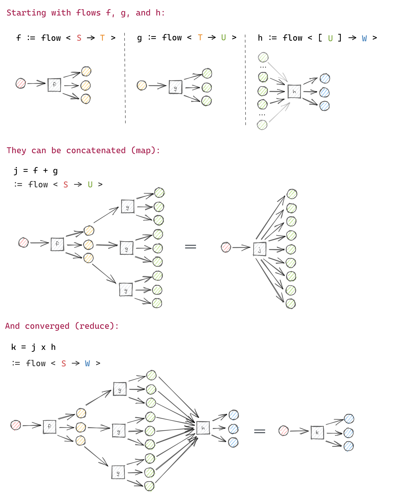

# Core Concepts (extended)

## Layer

A `layer` of _type_ `S` with _termination_ `E` is an array of either `Right<S>` or `Left<E>`:

```
Layer<S, E>
:= Either<E, S>[]
:= (Left<E> | Right<E>)[];
```

## Flow

A `flow` represents a computation that when applied on an input, results in an output `layer`.

A `flow` with _input_ type `S`, _output_ type `T` and _termination_ `E` can be applied to input of type `S` to return a promise of `Layer<T, E>`:

```ts
Flow<S, T, E>.exec := (S) -> Promise<Layer<T, E>>
```

A `flow` can be **_concatenated_** with another `flow` whose input type matches the first `layer`'s underlying type. The result is also a `flow`.

A `flow`'s `layer` can be **_converged_** into a new `layer` with a flow whose input type is an array of the first's `layer`'s underlying type.

\
Below is a diagram to try to simplify this concept:
\
\


## Termination

A termination is a `Left` result in a layer, which signifies the computation on this branch has come to an end.

The default termination type is `Error`.

To change the termination type, you must pass the `Flow.lift` function a 2nd argument that maps errors to their new type.

## Concatenation ( + )

> Coming soon

## Convergence ( x )

> Coming soon

## Layerable

A `layerable` is any type that can be transformed into a `layer`.

`Layerable<T, E>` is either of type `T`, `Either<E, T>` or an array of either:

```
Layerable<T, E>
:= (Either<E, T> | T)[] | Either<E, T> | T;
```

## Step

A `step` is a function that can be lifted into a `flow`.

More specifically, `Step<S, T, E>` is a function from input of type `S` to a `Layerable<T, E>` or a promise of one.

```
Step<S, T, E>
:= (S) => Promise<Layerable<T, E>> | Layerable<T, E>;

```
